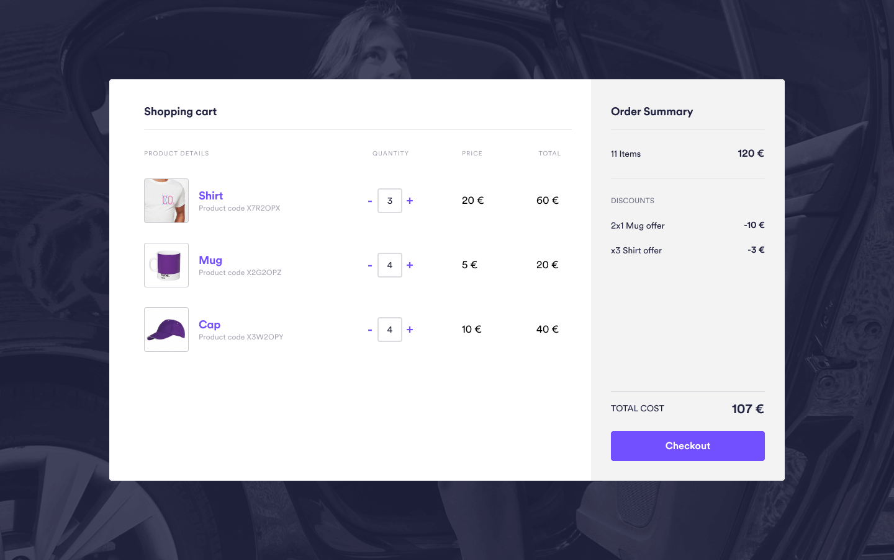

# Cabify Challenge

We welcome you to the first step in your hiring process at Cabify (Yayyy! :tada:). Being here means that you've already had a conversation with one of our hiring managers, so you know that this is the step in the middle before going to the actual interview.

That last process will give us an idea of how it would be working with you, but first, we want to make sure that you have the technical skills needed to work here, and we think the following challenge is great for that.

First and foremost, **read this document carefully**, as we want to make sure all the implementation details are well understood. As you will see in the explanation, there are some things that we **require you** to implement to consider this **exercise valid**. If you have any doubts after reading it, don't hesitate to ask your go-to person. We mean it, we try to be as concise and transparent as possible, but if you think something is not clear enough, please reach out to us and we'll be super happy to answer all your questions.

As a time estimate, we consider this should take you between 6 to 8 hours to complete. That doesn't mean you **have** to do it in that time. You might take more or less time. The important thing here is that you deliver something that you would happily deploy to production (except on a Friday, of course). We're well aware that even 8 hours is a long time to dedicate to something like this, but we think this is the best way to check whether you'd be a good fit.

But enough talk! Here's what we want you to do:

**As you already know, besides providing exceptional transportation services, Cabify also runs a physical store that sells 3 products for now:**

Our current stock consists of the following products:

```
Code         | Name                |  Price
-------------------------------------------------
TSHIRT       | Cabify T-Shirt      |  20.00€
MUG          | Cabify Coffee Mug   |   5.00€
CAP          | Cabify Cap          |  10.00€
```

We allow the users the possibility of having some discounts applied when combining the products in the following ways:

- 2-for-1 promotions: (for `MUG` items). Buy two of them, get one free. (e.g: pay 10€ for 4 mugs)
- Bulk discounts: (for `TSHIRT` items). Buying 3 or more of this product, the price per unit is reduced by 5%. (e.g: if you buy 3 or more `TSHIRT` items, the price per unit should be 19.00€)

Having said that, you need to implement the solution with the following **requirements**:

1. Create a **Checkout class** that **can** be instantiated. Make sure you include this in your final exercise. :rotating_light: We **won't consider the challenge valid** if you don't include this step. :rotating_light:

   Without taking into account the framework of your choice, try to implement **at least** the following interface. Feel free to add any extra constructor, properties, or methods you consider necessary for your provided solution:

   ```typescript
   interface Checkout {
     /**
      * Scans a product adding it to the current cart.
      * @param code The product identifier
      * @returns itself to allow function chaining
      */
     scan(code: string): this;
     /**
      * Returns the value of all cart products with the discounts applied.
      */
     total(): number;
   }
   ```

   An instance of this class should be able to add products via the `scan` method and, using the `total` method, obtain as a `number` the total price of the items in the cart **with the discounts already applied**.

   E.g:

   ```javascript
   const co = new Checkout(pricingRules);
   co.scan("TSHIRT").scan("CAP").scan("TSHIRT");
   const totalPrice = co.total();
   ```

1. As you can see, there hasn't been much time to implement the solution, but we've managed to deliver the markup and a basic implementation of the styles with vanilla _HTML_ and _CSS_. With the help of the **Checkout class** you have implemented previously, build the checkout page, ensuring that the users can interact with the products and the "Order summary" subsection is updated whenever one of them is added or removed.



Apart from that, we ask you to decompose the markup into components or whatever suits you better to make your final application a production-ready App.

You'll also need to add the presentation logic to update the "Order summary" subsection whenever a product is added or removed. Use the `Checkout` class to get the total and the discounts that are being applied.

As general guidelines, **take into account the following aspects:**

- Feel free to add as many comments as you'd like. We know this is an open debate, but in this case, we'd rather understand why you did certain things, **so be explicit about it**, explaining what trade-offs you had to do and why some things are included and others are left out.
- Deliver production-ready code. This can be a bit ambiguous, and we don't want you to stress about it. As we said, deliver something that you'd be comfortable with having in your production environment, taking into account the whole development workflow.
- Your solution **should be scalable**, so build your code in a way that can be easy to grow and easy to add new functionality.
- As stated before, feel free to ask anything you have doubts about, and act as a product owner.
- [BONUS]: Our UI engineers didn't have time to work on another feature we'd love to have. When clicking on a certain product, a modal should show up with the details of the said item. You'll find here the [UI design](https://www.figma.com/file/V3rITSBo9U30ESJeLnSarF/Frontend-challenge?node-id=0%3A1) and all the assets you will need inside `/bonus` folder. It would be a plus if you could implement it.

Concerning the technical guidelines, before submitting the challenge checks the next bullet points:

- [ ] The code must build and execute on a Unix platform.
- [ ] The code must be submitted in _Gitlab_ repo, in _master_ branch, **and avoid using a different branch**. Only _master_ branch should remain.
- [ ] To pay attention to `Checkout` class requirements, we will discard the challenge in case some requirement is missing.